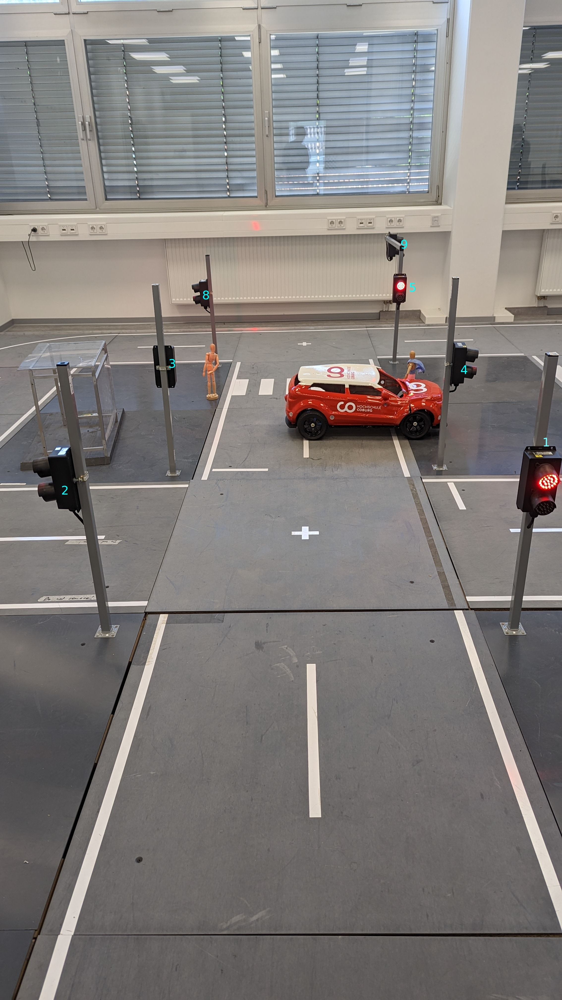
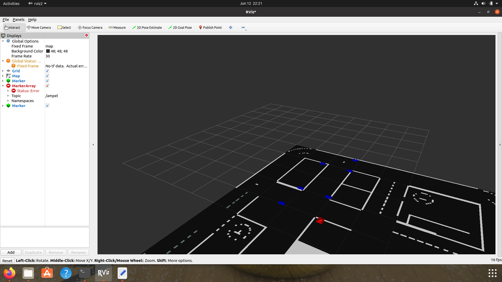

# Component for the static Marker :writing_hand:
This repositery have the code and 3D model for example Traffic Signal in Modelstadt.

# Introduction :traffic_light:

To visulaize the real time situation in model stadt, we have to create the marker Array for the same model.  

For further details please check out this repository 
git@git.hs-coburg.de:SMEC/map_und_pos.git

To visulize the static marker
- Clone this repository
```
 git clone git@git.hs-coburg.de:SMEC/static_marker.git
 ```
 ```
 colcon build
 ```
 ```
 source install/setup.bash
 ```
 ```
 ros2 run static_marker static_marker_node
```

The Number shown below near traffic signal is same as in script marker.py



# Troubleshooting :mag_right:
- Make sure that path is correct in the marker.py for the 3D object. 
- Check the 3D model is inside the model with there name
